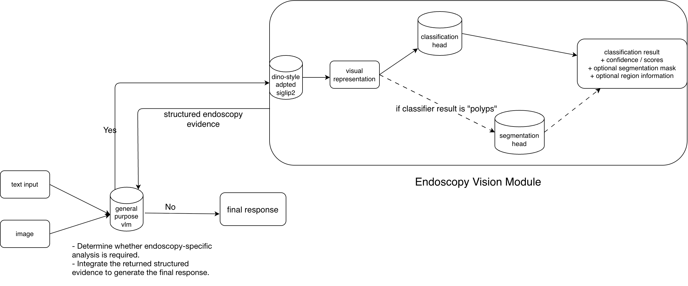

# HyperKvasir Multitask

A multimodal endoscopy assistant that combines a general-purpose vision-language model with a specialized endoscopy vision module for hierarchical classification and conditional polyp segmentation.

The system accepts **text, an image, or both**. A general-purpose VLM first determines whether specialized endoscopy analysis is required. If required, the image is passed to the Endoscopy Vision Module, which performs endoscopic finding classification and conditionally performs polyp segmentation. The resulting structured evidence is then returned to the VLM to generate the final response.

## Architecture

<p align="center">
  
</p>

## Endoscopy Vision Module

The specialist vision module uses a shared DINO-style adapted SigLIP2 encoder.

### Hierarchical Classification

The classification branch uses a two-stage hierarchy designed to separate easily distinguishable findings from groups of visually similar classes.

**Stage 1 — Coarse classification.**  
The DINO-style adapted SigLIP2 encoder extracts an L2-normalized visual embedding from the input image. After applying the saved feature standardization, an MLP classifier predicts a coarse class.

**Stage 2 — Conditional specialist classification.**  
If the coarse prediction already corresponds to a single leaf class, it becomes the final prediction directly. If the prediction corresponds to a merged group of visually similar classes, the image is routed to a dedicated Swin specialist classifier, which resolves the prediction into the final leaf class.

```text
                         ┌── Single leaf ───────────────→ Final class
                         │
Image → SigLIP2 → Coarse MLP
                         │
                         └── Merged class group
                                  ↓
                           Swin specialist
                                  ↓
                              Final class
```

This design keeps the shared SigLIP2 representation responsible for broad endoscopic classification while using specialist models only for ambiguous class groups that benefit from finer visual discrimination.

### Polyp Segmentation

When the final predicted class is `polyps`, the segmentation branch is activated:

```text
Image
  ↓
Shared SigLIP2 vision encoder
  ↓
Patch-token feature map
  ↓
Segmentation decoder
  ↓
Polyp probability map
  ↓
Binary segmentation mask
```

The predicted mask can additionally be overlaid on the original image to highlight the detected polyp region.

## Project Structure

```text
HyperKvasir-Multitask/
│
├── assets/
│   └── architecture.png                 # System architecture diagram
│
├── src/                                # Runtime inference modules
│   │
│   ├── endoscopy_vision/               # Specialist endoscopy vision module
│   │   ├── classification.py           # Hierarchical classifier: coarse MLP + specialist Swin models
│   │   ├── segmentation.py             # Polyp segmentation decoder and mask prediction
│   │   ├── model.py                    # Shared SigLIP2 encoder and classification/segmentation orchestration
│   │   └── config.py                   # Hugging Face checkpoints and inference configuration
│   │
│   └── vlm/
│       └── model.py                    # General-purpose VLM, routing, evidence integration, and final response generation
│
├── training src/                       # Model development and training pipelines
│   │
│   ├── classification/                 # Hierarchical endoscopy classification
│   │   ├── common.py                   # Shared classification utilities
│   │   ├── encoder_selection.py        # Encoder evaluation/selection experiments
│   │   ├── hierarchical_classifier.py  # Coarse hierarchical classifier training
│   │   ├── specialists.py              # Specialist classifiers for merged class groups
│   │   ├── siglip-cls-two-stage.ipynb  # Complete hierarchical classification workflow executed on Kaggle
│   │   └── results/                    # Classification experiment outputs
│   │
│   ├── segmentation/                   # Polyp segmentation training pipeline
│   │   ├── config.py                   # Segmentation training configuration
│   │   ├── data.py                     # Segmentation dataset and preprocessing
│   │   ├── model.py                    # Segmentation model/decoder definition
│   │   ├── train.py                    # Segmentation training loop
│   │   ├── inference.py                # Segmentation evaluation/inference utilities
│   │   ├── dino-siglip2-segmentation.ipynb     # Complete segmentation training workflow executed on Kaggle
│   │   └── results/                    # Segmentation experiment outputs
│   │
│   └── train_dino_style_siglip2/       # DINO-style SigLIP2 adaptation
│       ├── config.py                   # Encoder adaptation configuration
│       ├── data.py                     # Training data pipeline
│       ├── model.py                    # Teacher/student model definitions
│       ├── train.py                    # DINO-style adaptation training
│       ├── dinov2-style-siglip.ipynb   # Complete DINO-style encoder adaptation workflow executed on Kaggle
│       └── results/                    # Encoder training outputs
│
├── app.py                              # Gradio web interface
├── requirements.txt                    # Runtime dependencies
└── README.md                           # Project documentation
```

The repository separates **runtime inference** from **model training and experimentation**. `src/` contains only the components required by the deployed assistant, while `training src/` contains the pipelines used to develop the adapted encoder, hierarchical classifier, specialist classifiers, and segmentation model.

At runtime, `src/vlm/model.py` acts as the top-level orchestration layer. It determines whether specialist endoscopy analysis is required, invokes `src/endoscopy_vision/` when necessary, integrates the returned structured evidence, and produces the final multimodal response. `app.py` exposes this pipeline through the interactive Gradio interface.

## Model Checkpoints

The trained model checkpoints are hosted on Hugging Face and are downloaded automatically when the Endoscopy Vision Module is initialized.

Checkpoint repository:

[Lian70/HyperKvasir-Multitask](https://huggingface.co/Lian70/HyperKvasir-Multitask)

The specialist module uses:

- DINO-style adapted SigLIP2 encoder
- Hierarchical classifier
- Polyp segmentation decoder

The base vision encoder is:

`google/siglip2-base-patch16-224`

The general-purpose multimodal model is:

`Qwen/Qwen2.5-VL-3B-Instruct`

## Installation

Clone the repository:

```bash
git clone https://github.com/lilian70nn/HyperKvasir-Multitask.git
cd HyperKvasir-Multitask
```

Install dependencies:

```bash
pip install -r requirements.txt
```

A CUDA-enabled GPU is recommended because both the general-purpose VLM and the specialist endoscopy models are loaded during inference.

## Running the Application

Start the Gradio application:

```bash
python app.py
```

The application allows you to provide:

- text only
- an image only
- both text and an image

For local execution, open the URL printed by Gradio.

When running on a remote environment such as Google Colab, launch Gradio with sharing enabled and open the generated `gradio.live` URL.

## Python Usage

The Endoscopy Vision Module can also be used independently:

```python
from src.endoscopy_vision.model import load_model

model = load_model()

result = model.predict("example.jpg")

print(result["label"])
print(result["confidence"])

if result["segmentation"] is not None:
    mask = result["segmentation"]["mask"]
```

The complete multimodal assistant can be used through:

```python
from src.vlm.model import EndoscopyAssistantModel

model = EndoscopyAssistantModel()

result = model.predict(
    text="What do you see in this endoscopy image?",
    image="example.jpg",
)

print(result["answer"])

if result["annotated_image"] is not None:
    result["annotated_image"].show()
```

The assistant returns structured output containing the generated answer, optional specialist evidence, and an optional annotated image when polyp segmentation is available.

## Training

The Endoscopy Vision Module is built from three trained components:

1. **DINO-style SigLIP2 adaptation** — adapts the shared SigLIP2 visual encoder to endoscopic imagery.
2. **Hierarchical classification** — trains the coarse classifier and specialist classifiers using representations from the adapted encoder.
3. **Polyp segmentation** — trains the segmentation decoder using spatial features from the adapted encoder.

The resulting checkpoints are used by the runtime pipeline as the adapted visual encoder, hierarchical classifier, and segmentation decoder, respectively.

### Training Notebooks and Reproducibility

Each training directory contains a complete Jupyter notebook representing the workflow used to train and evaluate that component. These notebooks were executed on **Kaggle**, where saved notebook versions preserve the corresponding code and execution outputs.


| Component | Training Notebook | Kaggle Run |
| --- | --- | --- |
| DINO-style SigLIP2 adaptation | `train_dino_style_siglip2/dinov2-style-siglip.ipynb` | [View on Kaggle](https://www.kaggle.com/code/lilyii70/dinov2-style-siglip) |
| Hierarchical classification | `classification/siglip-cls-two-stage.ipynb` | [View on Kaggle](https://www.kaggle.com/code/lilyii70/siglip-cls-two-stage/output) |
| Polyp segmentation | `segmentation/dino-siglip2-segmentation.ipynb` | [View on Kaggle](https://www.kaggle.com/code/lilyii70/dino-siglip2-segmentation-py) |

The Kaggle notebook versions provide the executed training runs and their saved outputs, while the trained checkpoints used by the application are hosted separately on Hugging Face.